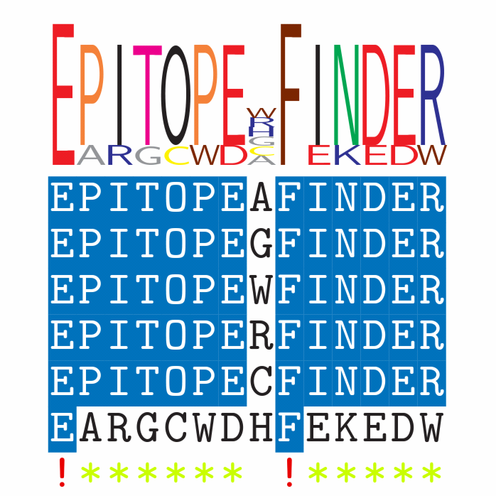
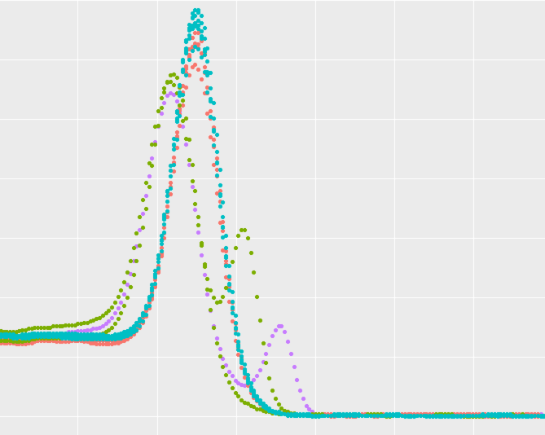

  

<a href = "https://github.com/brandonsie/epitopefinder">

<i class = "fa fa-search"></i> EpitopeFinder

</a>

<a href = "https://www.ncbi.nlm.nih.gov/pubmed/30190553">

<i class = "fa fa-search"></i> PhIP-Seq

</a>

<a href = "https://www.ncbi.nlm.nih.gov/pubmed/30190553">

<i class = "fa fa-search"></i> CLAmp-Seq

</a>

  

