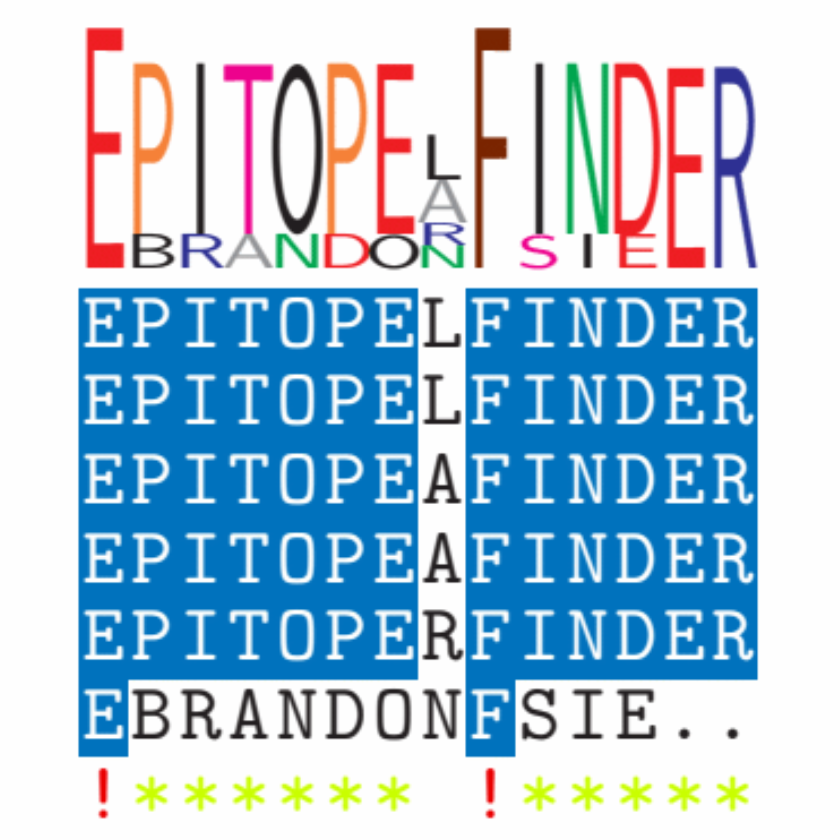
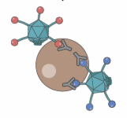
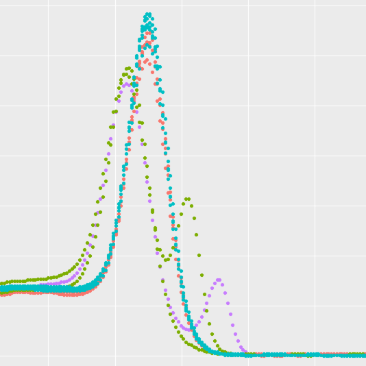
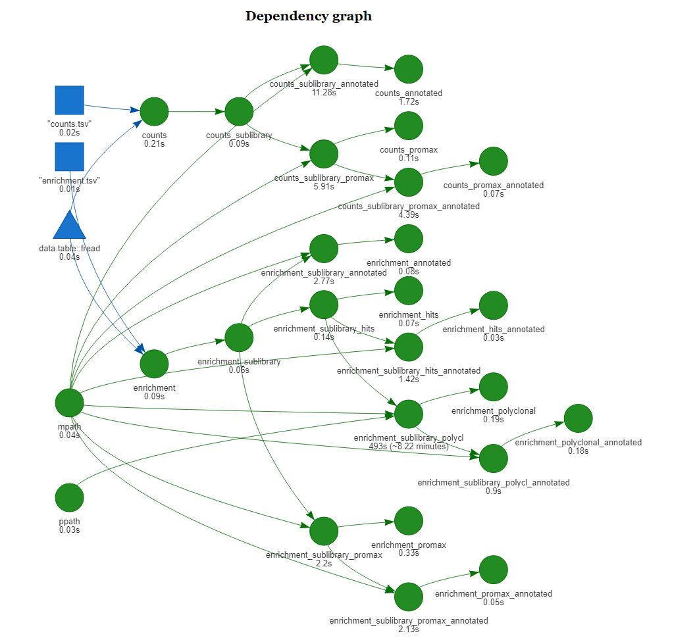

   

<!-- 

<h1>Selected Projects</h1> Some of the things that I'm currently working on. Mouseover for more information.

 -->

## Selected Projects
Some of the things I'm currently working on. Mouseover for more information.

<h3>epitopefindr</h3> R package to BLAST peptide sequences against each other and identify the minimal overlap of aligning regions [[<i class="fa fa-fw fa-github" aria-hidden="true"></i> Github](https://github.com/brandonsie/epitopefindr)].

<h3>PhIP-Seq</h3> Phage Immunoprecipitation Sequencing. High-throughput massively-multiplexed antibody profiling and biomarker discovery based on [phage display](https://www.nobelprize.org/prizes/chemistry/2018/press-release/) of synthetic peptidomes [[<i class="fa fa-fw fa-file" aria-hidden="true"></i> Pubmed](https://www.ncbi.nlm.nih.gov/pubmed/30190553)].

<h3>CLAmp-Seq</h3> Capture Ligation Amplification Sequencing. Solution-phase probe-based nucleic acid detection, adaptated from Ligation in situ Hybridization [[<i class="fa fa-fw fa-file" aria-hidden="true"></i> Pubmed](https://www.ncbi.nlm.nih.gov/pubmed/28854731)]. Currently in active development.

<h3>phipdrake</h3> Data analysis pipeline for PhIP-seq [[<i class="fa fa-fw fa-github" aria-hidden="true"></i> Github](https://github.com/brandonsie/phipdrake)].

<!-- 
 -->
<!-- 

<h3></h3>
 -->
<!-- 

 -->

<!-- 
 -->
<!-- 

<h3></h3>
 -->
<!-- 

 -->

<!-- 
 -->
<!-- 

<h3></h3>
 -->
<!-- 

 -->

