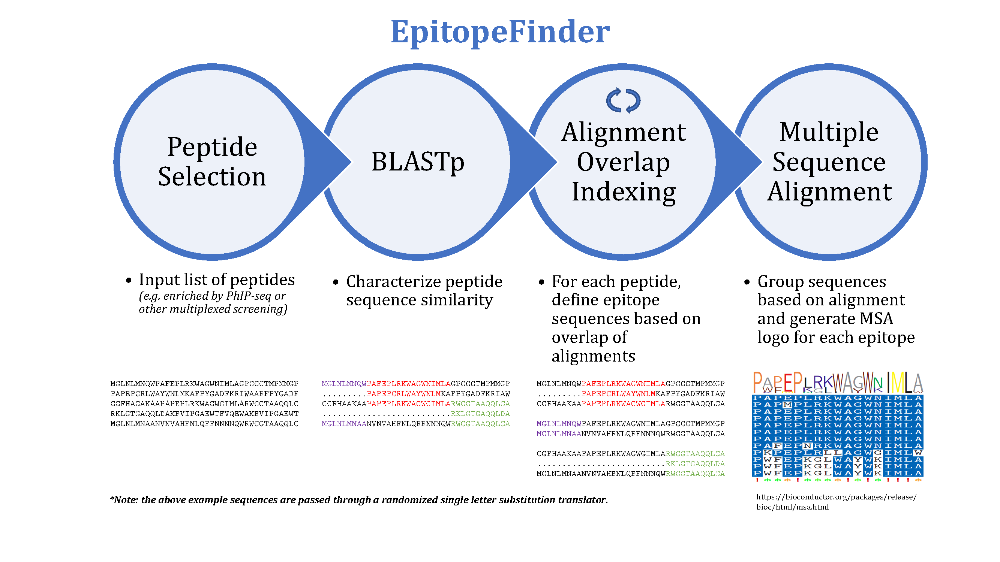

     

# Projects

Here are some of the things that I am currently working on. 

## Bioinformatics Tools

### EpitopeFinder 
R package to BLAST peptide sequences against each other and identify the minimal overlap of aligning regions. [[<i class="fa fa-fw fa-github" aria-hidden="true"></i> Github](https://github.com/brandonsie/EpitopeFinder)] 

## Assay Development

### PhIP-Seq  

Phage Immunoprecipitation Sequencing. High-throughput massively-multiplexed antibody profiling and biomarker discovery based on [phage display](https://www.nobelprize.org/prizes/chemistry/2018/press-release/) of synthetic peptidomes. [[<i class="fa fa-fw fa-file" aria-hidden="true"></i> Pubmed](https://www.ncbi.nlm.nih.gov/pubmed/30190553)]

### CLAmp-Seq  

Capture Ligation Amplification Sequencing. Solution-phase probe-based nucleic acid detection, adaptated from Ligation in situ Hybridization [[<i class="fa fa-fw fa-file" aria-hidden="true"></i> Pubmed](https://www.ncbi.nlm.nih.gov/pubmed/28854731)]. Currently in active development.

<!-- 
Make basic single-sentence summary on this page, link to more detail

epitopefinder
phip-reporter
stock vis
quantstudio tools

phip seq
clamp seq

text prediction 
-->

