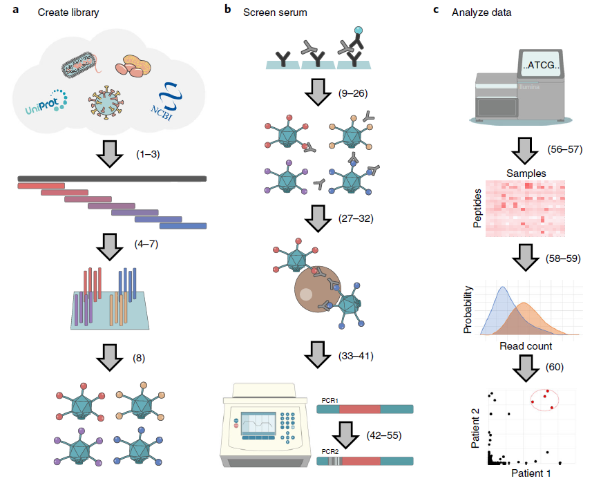

  

## Bioinformatics Tools

### EpitopeFinder 
R package to BLAST peptide sequences against each other and identify the minimal overlap of aligning regions. [[<i class="fa fa-fw fa-github" aria-hidden="true"></i> Github](https://github.com/brandonsie/EpitopeFinder)]  
  

## Assay Development

### PhIP-Seq  

Larman lab assay for high-throughput massively-multiplexed antibody profiling and biomarker discovery based on [phage display](https://www.nobelprize.org/prizes/chemistry/2018/press-release/) of synthetic peptidomes. [[<i class="fa fa-fw fa-file" aria-hidden="true"></i> Nature Protocols]](https://www.nature.com/articles/s41596-018-0025-6)

### CLAmp-Seq  

## Other Code

<!-- 
Make basic single-sentence summary on this page, link to more detail

epitopefinder
phip-reporter
stock vis
quantstudio tools

phip seq
clamp seq

text prediction 
-->

